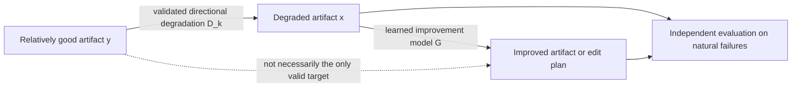
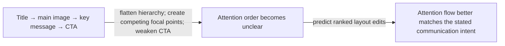

# Quality Without Scores

> Generate supervision for improvement without first assigning every training example a scalar quality score.

Many valuable qualities are difficult to measure directly: visual hierarchy, clarity, modularity, explanatory flow, maintainability, elegance, or biological design quality. Yet it may be easier to define a controlled transformation that makes a relatively good example worse along one specific axis while preserving its underlying meaning, function, or content.

This repository is a public-domain catalog of research and product hypotheses built around that asymmetry.

## What the title means

**Quality Without Scores does not mean evaluation without evidence.**

The method still requires:

- evidence that the proposed degradation usually moves examples in the wrong direction;
- checks that meaning, function, facts, or other invariants were preserved;
- evaluation on naturally occurring failures;
- human or domain-expert judgment when automatic checks are insufficient.

The narrower claim is that manually assigned **scalar training labels** may sometimes be replaced by controlled directional transformations.

## Core idea

Given a relatively good artifact `y`:

1. Propose a quality axis `k` and a controlled degradation operator `D_k`.
2. Validate that people or domain evidence usually prefer `y` to `D_k(y)` under a stated intent.
3. Check that required invariants remain unchanged.
4. Train a model to propose an improved artifact or edit plan from the degraded example.
5. Test whether the model transfers to natural failures and unseen degradation families.

The strongest useful case is:

> **degradation is cheap, repair is hard, and verification is independent and affordable.**

## Flagship illustration: visual attention in posters

_Illustrative concept only — not a model result._

The text, images, message, brand constraints, and canvas can remain fixed while typographic hierarchy, contrast, proximity, and placement are degraded. The research question is not whether a model can reverse a known formatting script. It is whether training on varied, validated degradations improves naturally weak posters under human scan-path and task-based evaluation.

## Minimum credible experiment

A result supports the method only when it includes all of the following:

1. **Operator validation** — independent raters or domain evidence confirm the degradation direction.
2. **Invariant checks** — the degradation and repair preserve required meaning or function.
3. **Rule baseline** — the model outperforms deterministic reversal or proxy optimization.
4. **Held-out parameters** — it generalizes beyond seen strengths and locations.
5. **Held-out operator families** — it handles a degradation implementation not used in training.
6. **Natural-failure transfer** — it improves real low-quality artifacts not generated by the pipeline.
7. **No-edit and abstention tests** — it avoids damaging examples that should not be changed.
8. **Predeclared kill criteria** — the project states what outcome would make the hypothesis unpromising.

Without items 5 and 6, the result is primarily evidence of synthetic operator inversion.

## What this repository contains

- [`METHOD.md`](METHOD.md) — formal framing, operator validation, and boundaries
- [`CATALOG.md`](CATALOG.md) — 20 cross-disciplinary candidate applications and falsification criteria
- [`LANDSCAPE.md`](LANDSCAPE.md) — prior work, adjacent products, and narrower open gaps
- [`EVIDENCE.md`](EVIDENCE.md) — evidence-type labels and representative-source maturity
- [`EVALUATION.md`](EVALUATION.md) — evaluation protocol, baselines, and failure-mode checks
- [`CONTRIBUTING.md`](CONTRIBUTING.md) — how to add an idea or correct the landscape

No implementation is required. The goal is to make hypotheses explicit enough that others can reject, test, build, publish, or commercialize them independently.

## Candidate status and confidence

The catalog uses qualitative estimates rather than unexplained precision:

- `High`, `Medium`, `Low`, or `Unknown` for generation, verification, and impact;
- `Low`, `Medium`, or `High` confidence in those estimates;
- `literature-scoped`, `domain-review-needed`, or `domain-reviewed` for review status.

These labels are provisional. They are not experimental results or expert consensus.

## Evidence status

The catalog is not presented as a list of inventions with no precedent. Denoising, synthetic corruption, refactoring, simplification, inverse problems, preference learning, and constrained optimization already cover parts of the space.

[`LANDSCAPE.md`](LANDSCAPE.md) links every candidate to existing research and adjacent tools. [`EVIDENCE.md`](EVIDENCE.md) distinguishes peer-reviewed work, proceedings papers, preprints, official tools, and product pages. The strongest defensible organizing claim is:

> **Named, graded, invariant-checked degradation operators may provide scalable supervision for hard-to-score quality directions, provided they transfer to natural failures under independent evaluation.**

## Important limitations

- A proposed degradation may encode the author's taste rather than a stable quality direction.
- The source artifact may be merely acceptable, not optimal.
- Several different improved outputs may be valid.
- A model may memorize operator fingerprints or deterministic reversals.
- Automatic metrics may be circular if the same heuristic generates and evaluates the data.
- High-stakes domains require domain review and should not be treated as autonomous deployment proposals.
- The broad pattern overlaps with established fields; novelty must be argued at the level of a specific experiment.

## Public-domain dedication

The contents of this repository are dedicated to the public domain under [CC0 1.0 Universal](LICENSE). You may use, copy, modify, publish, implement, or commercialize the ideas and text here without permission or attribution.

This dedication does not waive third-party rights, patents, trademarks, privacy rights, or rights in external datasets and artifacts.